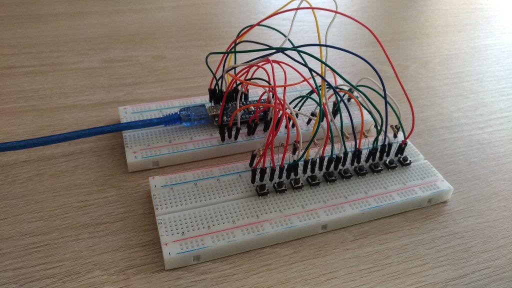
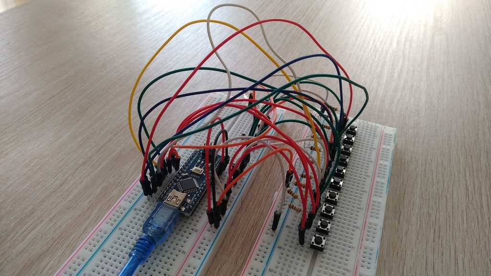
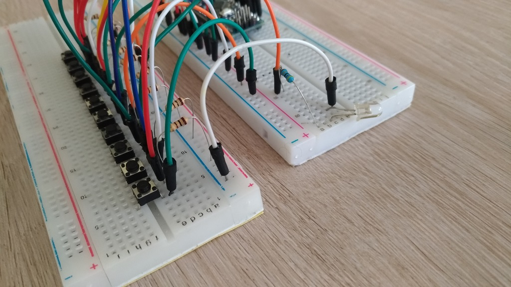
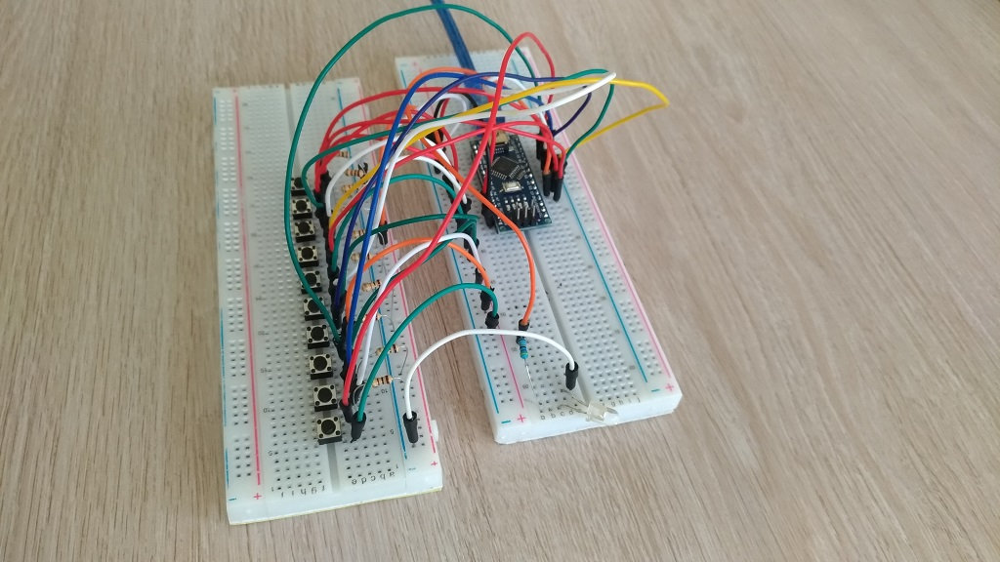
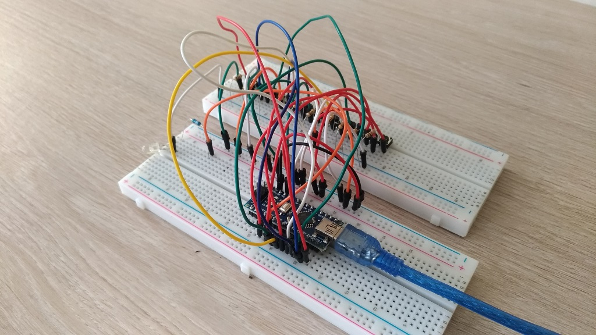

<h3>Created by Tamás Szabó</h3>

  13.04.2020

  E-mail: szabotamas6@gmail.com
  
  -IR Transmitter for Samsung TV remote controller
  
  
-Main buttons like:   Power, Source, Volume UP, Volume DOWN, Control arrows, OK (middle) button, Return

  
  <h3>Tested on:</h4> 
  <ul>
  <li>SAMSUNG LE40B530p7</li> 
  <li>SAMSUNG UE43NV7122</li>
  </ul>      
<h2>Samsung remote controller clone with arduino.</h2>

<h4>I am using Arduino NANO</h4>
  
  <h3>For this project you need:</h3>
  <ol>
   <li>Arduino (from size point of view I prefer NANO but other types can be good</li>
   <li>10pcs of push-button</li>
   <li>10pcs of 1K or 10K Ohm resistors</li>
   <li>IR LED</li>
   <li>50 Ohm resistor</li>
   <li>20+ jumper wires</li>
</ol>

Right now I am ready with the breadboard version and I will make the normal PCB version too shortly.

   
 
 

